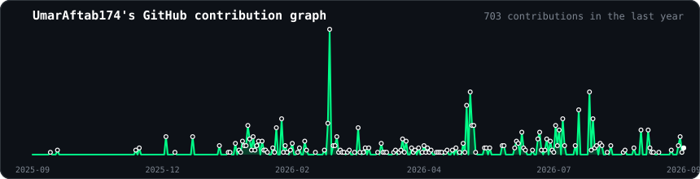

<!-- Hero: ASCII portrait + info panel -->
<table>
<tr>
<td valign="top"></td>
<td valign="top"></td>
</tr>
</table>

## Umar Aftab

**AI Engineer · LLM Fine-Tuning & On-Premise Deployment · Full-Stack Developer**

 

<!-- Self-hosted contribution graph, regenerated daily by .github/workflows/update-profile-art.yml -->

---
## What I Believe
- **Models are just the beginning** - production infra, latency, and reliability are where real AI engineering happens.
- **Metrics without context are noise** - I care about what a number means for the user, not just the leaderboard.
- **Scope beats complexity** - a focused system that ships beats a perfect one that doesn't.
- **Read the failure cases** - the edge cases tell you more about a system than the happy path ever will.

---
## What I build
I build production-ready AI systems, not just models. My current focus is fine-tuning and deploying LLMs on-premise for privacy-sensitive environments, alongside computer vision pipelines and full-stack ML inference backends. I care about latency, scalability, and systems that hold up outside the notebook.

---
## What I've Shipped
- **On-Premise LLM Deployment at Unikrew Soltions** - Fine-tuned an open-source LLM via two-stage QLoRA on a ~50GB curated domain corpus for a regulated fintech environment; benchmarked vLLM against llama.cpp (GGUF) serving and selected llama.cpp for on-premise inference. **Stack:** Unsloth, QLoRA, vLLM, llama.cpp, RTX 5090.
- [**Roman Urdu Banking Intent Understanding**](https://github.com/UmarAftab174/roman-urdu-banking-dataset-comparitive-analysis) - Comparative NLP study across TF-IDF + Logistic Regression, a QLoRA-fine-tuned Llama 3.1 8B, and unsupervised topic modeling on a manually annotated banking-intent dataset; fine-tuned model deployed locally via Ollama. **Stack:** Unsloth, llama.cpp, BERTopic.
- [**Skin Lesion Classification**](https://github.com/UmarAftab174/skin-cancer-detection) - End-to-end 7-class dermoscopic image classifier on HAM10000; hybrid Swin-B + Squeeze-and-Excitation model reaching 90.15% accuracy and 98.66% macro ROC-AUC. **Stack:** PyTorch, ConvNeXt, Swin Transformer.
- [**LLM Business Automation Platform**] - Modular LangChain agent workflows with function calling, RAG over Pinecone, and natural-language task execution. **Stack:** FastAPI, Redis, PostgreSQL, Docker, GCP Cloud Run.
- [**MediBot**](https://github.com/UmarAftab174/medibot) - AI diagnostic assistant with 91% accuracy on 773 diseases. **Stack:** FastAPI, React, Gemini LLM, JWT auth.
- [**FN Crib**](https://fncrib.com) - Dockerized gaming marketplace with 24,600+ orders and a 4.9-star rating, dual crypto/fiat payment processing. **Stack:** Laravel, PostgreSQL, Redis.
- **Healthcare Smart App** - Multimodal anomaly detection with sub-100ms inference. **Stack:** Flutter, FastAPI, WebSockets.
- [**Rang**](https://github.com/UmarAftab174/rang) - On-device AI mobile app for plastic color classification. **Stack:** CNN, Flutter.
- **Computer Vision Pipeline** - YOLO + ByteTrack at 30 FPS, 82% mAP. **Stack:** Python, OpenCV.
- **Student Churn Prediction** - Data Analyst internship project at Excelerate: engineered features across 100,000+ data points, improving data quality by 30%, and built an 85%-accuracy churn model to flag at-risk students.

---
## A Bit About Me
I'm a final-year AI undergraduate at Bahria University Karachi. Currently interning at Unikrew Solutions, where I lead the LLM component of an internal initiative, evaluating and fine-tuning an open-source model for on-premise deployment to keep sensitive data off third-party APIs. I build AI systems that bridge the gap between research and production, with a focus on **fintech, healthcare, and automation**. Open to collaborations and full-time opportunities.

---
## Certifications & Activities
**Certifications:** Meta Back-End Developer (Coursera) · Associate Data Scientist (DataCamp) · AWS Cloud Practitioner CLF-C02 (DataCamp) · TensorFlow: Data and Deployment (DeepLearning.AI) · Summer Bootcamp - Artificial Intelligence Fundamentals · Google Cloud Training Workshop

**Awards:** Runner-up, Techathon (Machine Learning) at Bahria University · Winner, Science Exhibition (Computer Science Category) at Bahria College Karachi · Participant, Coder's Clash Competition

**Leadership (BU Artificial Intelligence Club):** President (Nov 2024 - Aug 2026) · Vice President (Mar - Dec 2025) · Secretary General (Feb - Mar 2025) · Technical Team Member (Nov 2024 - Feb 2025)