<!-- Hero: ASCII portrait + info panel -->
<table>
<tr>
<td valign="top"></td>
<td valign="top"></td>
</tr>
</table>

## Umar Aftab

**AI Engineer · Full-Stack Developer · BU AI Club President**

 

<!-- Animated contribution graph -->

---
## What I Believe
- **Models are just the beginning** — production infra, latency, and reliability are where real AI engineering happens.
- **Metrics without context are noise** — I care about what a number means for the user, not just the leaderboard.
- **Scope beats complexity** — a focused system that ships beats a perfect one that doesn't.
- **Read the failure cases** — the edge cases tell you more about a system than the happy path ever will.

---
## What I’ve Shipped
[**LLM Business Automation Platform**](https://github.com/UmarAftab174) — Modular LangChain agent workflows with function calling, RAG over Pinecone, and natural-language task execution. **Stack:** FastAPI, Redis, PostgreSQL, Docker, GCP Cloud Run.
[**MediBot**](https://github.com/UmarAftab174/medibot) — AI diagnostic assistant with 91% accuracy on 773 diseases. **Stack:** FastAPI, React, Gemini LLM, JWT auth.
[**FN Crib**](https://github.com/UmarAftab174/fn-crib) — Dockerized e-commerce platform with Laravel, PostgreSQL, and crypto payments.
[**Rang**](https://github.com/UmarAftab174/rang) — On-device AI mobile app for plastic color classification. **Stack:** CNN, Flutter.
[**Healthcare Smart App**](https://github.com/UmarAftab174) — Multimodal anomaly detection with sub-100ms inference. **Stack:** Flutter, FastAPI, WebSockets.
[**Computer Vision Pipeline**](https://github.com/UmarAftab174) — YOLO + ByteTrack at 30 FPS, 82% mAP. **Stack:** Python, OpenCV.

---
## A Bit About Me
President of the [BU Artificial Intelligence Club](https://www.linkedin.com/company/bu-artificial-intelligence-club). I build AI systems that bridge the gap between research and production, with a focus on **healthcare, security, and automation**.